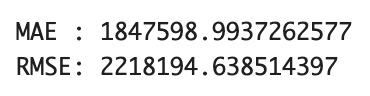
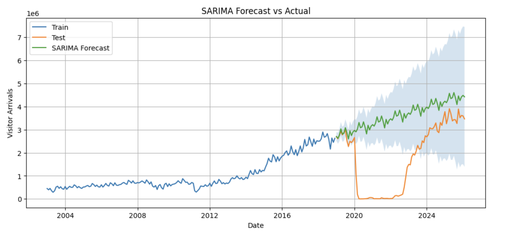

# Time Series Forecasting of Visitor Arrivals to Japan

Using SARIMA to analyze seasonality and forecast inbound tourism demand.

---

## Overview

This project analyzes and forecasts monthly inbound visitor arrivals to Japan using time series methods.

The dataset is based on official statistics published by JNTO and spans from 2003 to 2026.

---

## Data Source

- Source: JNTO (Japan National Tourism Organization)
- Data: Monthly inbound visitor arrivals
- Format: Excel (processed into time series format)

---

## Data Processing

The original dataset is provided in Excel format with multiple sheets and a complex structure.

In this project:

- Extracted total monthly visitor arrivals from each sheet
- Converted the data into a clean time series format
- Stored the processed dataset as a CSV file

---

## Exploratory Data Analysis

The dataset reveals several key patterns:

- Long-term upward trend in inbound tourism
- Clear seasonality (monthly patterns)
- Structural break during the COVID-19 pandemic (2020)
- Strong recovery starting from 2023

---

## Modeling

A SARIMA model was applied to capture:

- Trend
- Seasonality (12-month cycle)

Train/Test split:
- Train: before 2019
- Test: 2019 onward (includes COVID-19 period)

---

## Results

The SARIMA model captures long-term trends and seasonality reasonably well.

However:

- It fails to account for the structural break caused by COVID-19
- This results in large prediction errors during 2020–2022

---

## Evaluation

- MAE: ~1.85 million
- RMSE: ~2.22 million

These large errors are primarily due to the extreme disruption during the pandemic.

---

## Key Insight

Traditional time series models like SARIMA work well under stable conditions.

However, they struggle to handle sudden external shocks such as:

- Pandemics
- Policy changes
- Travel restrictions

---

### Time Series Forecasting of Visitor Arrivals to Japan

## Conclusion
The SARIMA model captures long-term trends and seasonality reasonably well.
However, it fails to account for the structural break caused by COVID-19,
resulting in large prediction errors during 2020–2022.

### Requirements
pandas, matplotlib, seaborn, statsmodels

## Repository Structure

data/
　raw/ # Original Excel data
　processed/ # Cleaned time series data
notebook/ # tourism_time_series_forecast.ipynb

---

## Author

Ryo | Tourism Data Analysis
